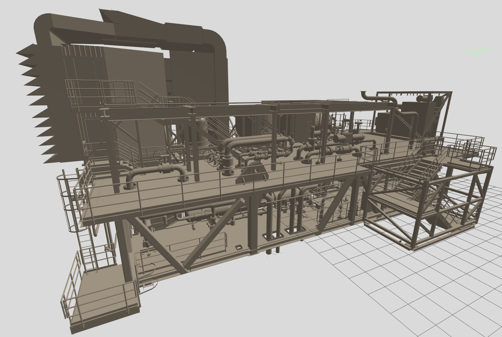

# Gazebo Huldra Platform

## Overview

The `gazebo_huldra_platform_description` package provides a simplified
representation of the Huldra offshore platform for robotic simulation.

The model focuses on the platform's upper section and includes environmental
elements relevant to simulation. The platform is provided as an STL mesh and
is configured for both visualization and collision in Gazebo.

ROS 2 launch files are included to start Gazebo Harmonic and load the
platform world and model.

<p align="center">
  
</p>

**Keywords:** simulation, oil & gas, offshore platform, Gazebo, ROS 2, Huldra

## License

The source code is released under an [Apache License 2.0](LICENSE).

The file [he_simplified.stl](models/he_huldra_simplified/meshes/he_simplified.stl) is adapted from the Huldra 3D model dataset made available by Equinor ASA. The original FBX data was processed and simplified in Blender before being exported as an STL mesh.

The adapted material is subject to the [Equinor Open Data Sharing License for Huldra](THIRD_PARTY_LICENSES/Equinor-Huldra-Data-License.pdf).

See the [NOTICE](NOTICE) file for attribution and additional information.​‌

**Author:** Lucas Baião Junqueira<br>
**Affiliation:** SENAI CIMATEC<br>
**Maintainer:** Lucas Baião Junqueira, lucas.junqueira@aln.senaicimatec.edu.br

The `gazebo_huldra_platform_description` package has been tested with:

- Ubuntu 24.04 LTS (Noble Numbat)
- ROS 2 Jazzy Jalisco
- Gazebo Harmonic

## Dependencies

The main requirements are:

- ROS 2 Jazzy Jalisco
- Gazebo Harmonic
- `ros_gz_sim`

Install the package dependencies from the workspace root using `rosdep`:

```bash
rosdep install --from-paths src --ignore-src -r -y
```

## Package layout

- `launch/`: contains the ROS 2 launch file used to start Gazebo and load the scenario.
- `models/`: contains the Gazebo model description and the simplified STL mesh.
- `worlds/`: contains the Gazebo world file.
- `thumbnails/`: contains images used in the repository documentation.
- `package.xml`: contains the package metadata and dependencies.
- `CMakeLists.txt`: defines the package installation configuration.
- `README.md`: contains the package documentation.
- `CONTRIBUTING.md`: contains the contribution guidelines.
- `LICENSE`: contains the project license.
- `CHANGELOG.md`: records relevant changes for each package version.
- `NOTICE`: contains attribution and additional information about third-party material.
- `THIRD_PARTY_LICENSES/`: contains the license terms applicable to third-party material.

## Building and installation

First, install ROS 2 Jazzy and Gazebo Harmonic.

Clone the repository into the `src` directory of a ROS 2 workspace:

```bash
cd YOUR_WORKSPACE/src

git clone https://github.com/Brazilian-Institute-of-Robotics/gazebo_huldra_platform_description.git
```

Install the dependencies and build the package:

```bash
cd YOUR_WORKSPACE

source /opt/ros/jazzy/setup.bash

rosdep install --from-paths src --ignore-src -r -y

colcon build \
  --packages-select gazebo_huldra_platform_description \
  --symlink-install \
  --event-handlers console_direct+
```

Source the workspace after the build:

```bash
source install/setup.bash
```

The `--symlink-install` option is recommended for development because changes
to installed resource files can be reflected without rebuilding the entire
package.

## Unit Tests

Run the package tests from the workspace root:

```bash
colcon test \
  --packages-select gazebo_huldra_platform_description \
  --event-handlers console_direct+

colcon test-result --verbose
```

## Usage

Source the workspace and launch the Huldra platform scenario:

```bash
source install/setup.bash

ros2 launch gazebo_huldra_platform_description \
  gazebo_huldra_platform_description.launch.py
```

The platform model is offset in the world so that the selected operational starting point is aligned with the Gazebo world origin at `X = 0` and `Y = 0`. This provides a consistent reference point for spawning simulation entities.

## Launch file

The package provides the following launch file:

- `launch/gazebo_huldra_platform_description.launch.py`

This launch file starts Gazebo Harmonic and loads the Huldra platform world
and model.

## Bugs & Feature Requests

Please report bugs and request features using the repository's [Issue Tracker](https://github.com/Brazilian-Institute-of-Robotics/gazebo_huldra_platform_description/issues).

## Acknowledgments

The author acknowledges Rebeca Tourinho Lima for her supervisory contribution
to the conception and development of this package.
